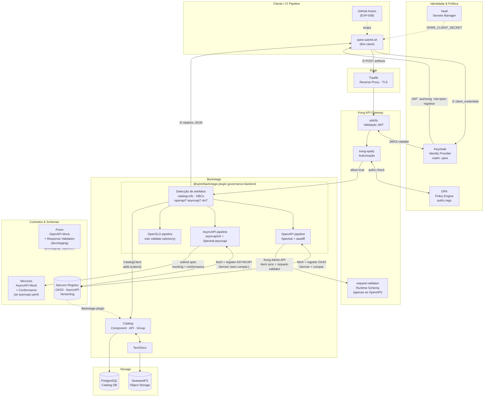
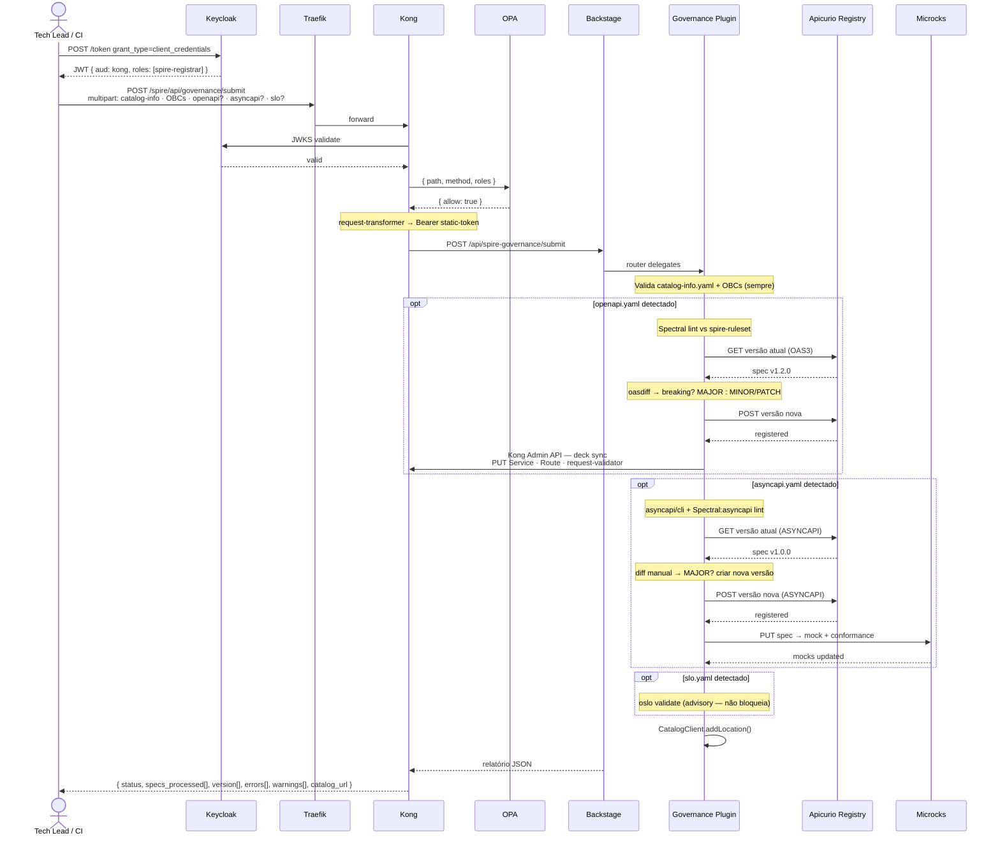
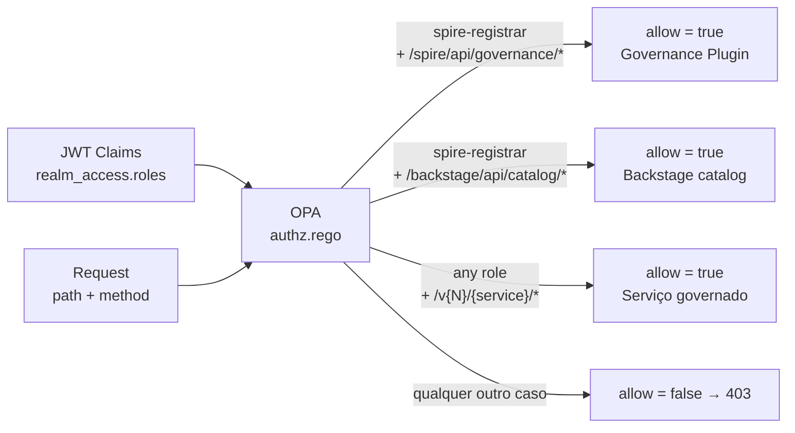
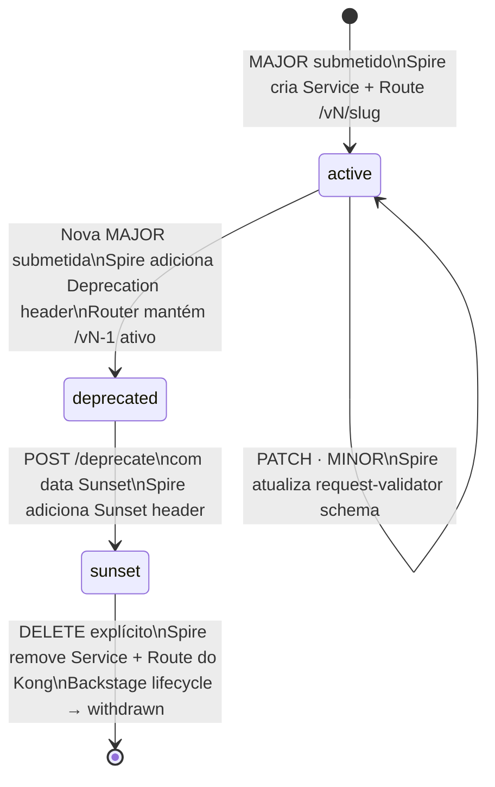

# Spire — Diagramas de Arquitetura

---

## Diagrama de Componentes

```mermaid
graph TB
    subgraph CLI["Cliente / CI Pipeline"]
        script["spire-submit.sh\n(thin client)"]
        gha["GitHub Action\n(EXP-008)"]
    end

    subgraph EDGE["Edge"]
        traefik["Traefik\nReverse Proxy · TLS"]
    end

    subgraph GW["Kong API Gateway"]
        oidcify["oidcify\nValidação JWT"]
        opafy["kong-opafy\nAutorização"]
        reqval["request-validator\nRuntime Schema\n(apenas se OpenAPI)"]
    end

    subgraph AUTH["Identidade & Política"]
        keycloak["Keycloak\nIdentity Provider\nrealm: spire"]
        opa["OPA\nPolicy Engine\nauthz.rego"]
        vault["Vault\nSecrets Manager"]
    end

    subgraph PLATFORM["Backstage"]
        subgraph PLUGIN["@spire/backstage-plugin-governance-backend"]
            detect["Detecção de artefatos\ncatalog-info · OBCs\nopenapi? asyncapi? slo?"]
            val_oas["OpenAPI pipeline\nSpectral + oasdiff"]
            val_async["AsyncAPI pipeline\nasyncapi/cli + Spectral:asyncapi"]
            val_slo["OpenSLO pipeline\noslo validate (advisory)"]
            detect --> val_oas
            detect --> val_async
            detect --> val_slo
        end
        catalog["Catalog\nComponent · API · Group"]
        techdocs["TechDocs"]
    end

    subgraph CONTRACTS["Contratos & Schemas"]
        apicurio[("Apicurio Registry\nOAS3 · AsyncAPI\nVersioning")]
        microcks["Microcks\nAsyncAPI Mock\n+ Conformance\n(se asyncapi.yaml)"]
        prism["Prism\nOpenAPI Mock\n+ Response Validation\n(dev/staging)"]
    end

    subgraph STORAGE["Storage"]
        postgres[("PostgreSQL\nCatalog DB")]
        seaweed[("SeaweedFS\nObject Storage")]
    end

    gha -. wraps .-> script
    vault -. SPIRE_CLIENT_SECRET .-> script

    script -->|"① client_credentials"| keycloak
    keycloak -->|"JWT  aud:kong  role:spire-registrar"| script
    script -->|"② POST artifacts"| traefik
    traefik --> oidcify
    oidcify <-->|"JWKS validate"| keycloak
    oidcify --> opafy
    opafy <-->|"authz check"| opa
    opafy -->|"allow=true"| detect

    val_oas <-->|"fetch + register OAS3\nSemver + compat."| apicurio
    val_async <-->|"fetch + register ASYNCAPI\nSemver (sem compat.)"| apicurio
    val_oas -->|"Kong Admin API\ndeck sync + request-validator"| reqval
    val_async -->|"submit spec\nmocking + conformance"| microcks

    detect -->|"CatalogClient\naddLocation()"| catalog
    detect -->|"③ relatório JSON"| script

    apicurio -. Backstage plugin .-> catalog
    catalog <--> techdocs
    catalog --> postgres
    techdocs --> seaweed
    prism -. dev/staging · OpenAPI .-> CONTRACTS
```

---

## Fluxo de Governança (Sequência)

```mermaid
sequenceDiagram
    actor Dev as Tech Lead / CI
    participant KC as Keycloak
    participant T  as Traefik
    participant K  as Kong
    participant O  as OPA
    participant BS as Backstage
    participant GP as Governance Plugin
    participant AP as Apicurio Registry
    participant MC as Microcks

    Dev->>KC: POST /token  grant_type=client_credentials
    KC-->>Dev: JWT { aud: kong, roles: [spire-registrar] }

    Dev->>T: POST /spire/api/governance/submit<br/>multipart: catalog-info · OBCs · openapi? · asyncapi? · slo?
    T->>K: forward
    K->>KC: JWKS validate
    KC-->>K: valid
    K->>O: { path, method, roles }
    O-->>K: { allow: true }
    Note over K: request-transformer → Bearer static-token
    K->>BS: POST /api/spire-governance/submit
    BS->>GP: router delegates

    Note over GP: Valida catalog-info.yaml + OBCs (sempre)

    opt openapi.yaml detectado
        Note over GP: Spectral lint vs spire-ruleset
        GP->>AP: GET versão atual (OAS3)
        AP-->>GP: spec v1.2.0
        Note over GP: oasdiff → breaking? MAJOR : MINOR/PATCH
        GP->>AP: POST versão nova
        AP-->>GP: registered
        GP->>K: Kong Admin API — deck sync<br/>PUT Service · Route · request-validator
    end

    opt asyncapi.yaml detectado
        Note over GP: asyncapi/cli + Spectral:asyncapi lint
        GP->>AP: GET versão atual (ASYNCAPI)
        AP-->>GP: spec v1.0.0
        Note over GP: diff manual → MAJOR? criar nova versão
        GP->>AP: POST versão nova (ASYNCAPI)
        AP-->>GP: registered
        GP->>MC: PUT spec → mock + conformance
        MC-->>GP: mocks updated
    end

    opt slo.yaml detectado
        Note over GP: oslo validate (advisory — não bloqueia)
    end

    GP->>GP: CatalogClient.addLocation()

    BS-->>K: relatório JSON
    K-->>Dev: { status, specs_processed[], version[], errors[], warnings[], catalog_url }
```

---

## Modelo de Autorização (OPA)

```mermaid
graph LR
    JWT["JWT Claims\nrealm_access.roles"]
    PATH["Request\npath + method"]
    OPA["OPA\nauthz.rego"]

    OPA -->|"spire-registrar\n+ /spire/api/governance/*"| A1["allow = true\nGovernance Plugin"]
    OPA -->|"spire-registrar\n+ /backstage/api/catalog/*"| A2["allow = true\nBackstage catalog"]
    OPA -->|"any role\n+ /v{N}/{service}/*"| A3["allow = true\nServiço governado"]
    OPA -->|"qualquer outro caso"| DENY["allow = false → 403"]

    JWT --> OPA
    PATH --> OPA
```

---

## Lifecycle de Versão de API no Kong

```mermaid
stateDiagram-v2
    [*] --> active : MAJOR submetido\nSpire cria Service + Route /vN/slug

    active --> active : PATCH · MINOR\nSpire atualiza request-validator schema

    active --> deprecated : Nova MAJOR submetida\nSpire adiciona Deprecation header\nRouter mantém /vN-1 ativo

    deprecated --> sunset : POST /deprecate\ncom data Sunset\nSpire adiciona Sunset header

    sunset --> [*] : DELETE explícito\nSpire remove Service + Route do Kong\nBackstage lifecycle → withdrawn
```
